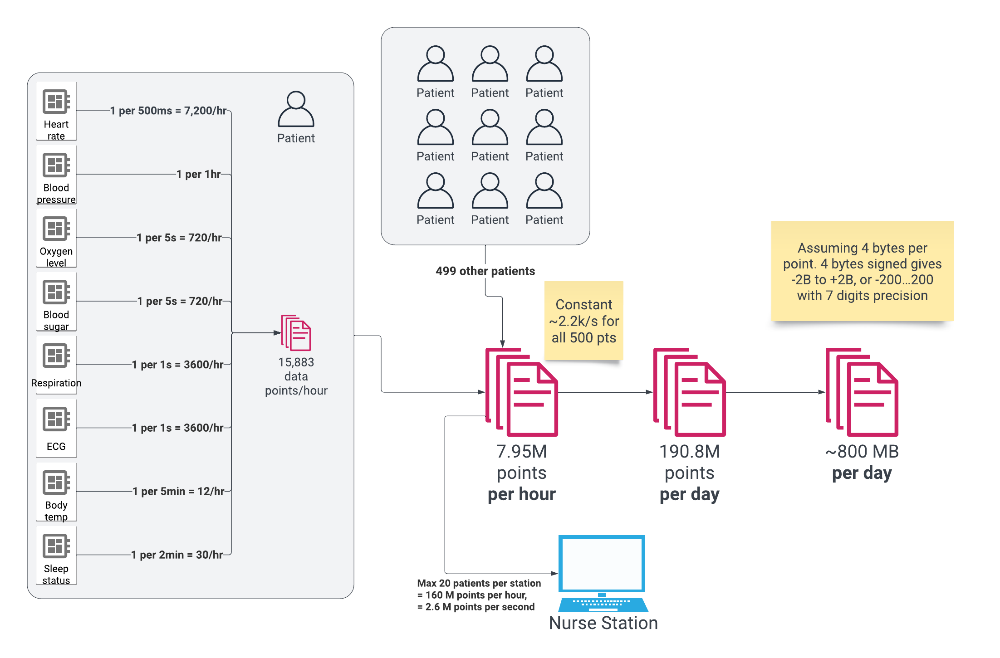
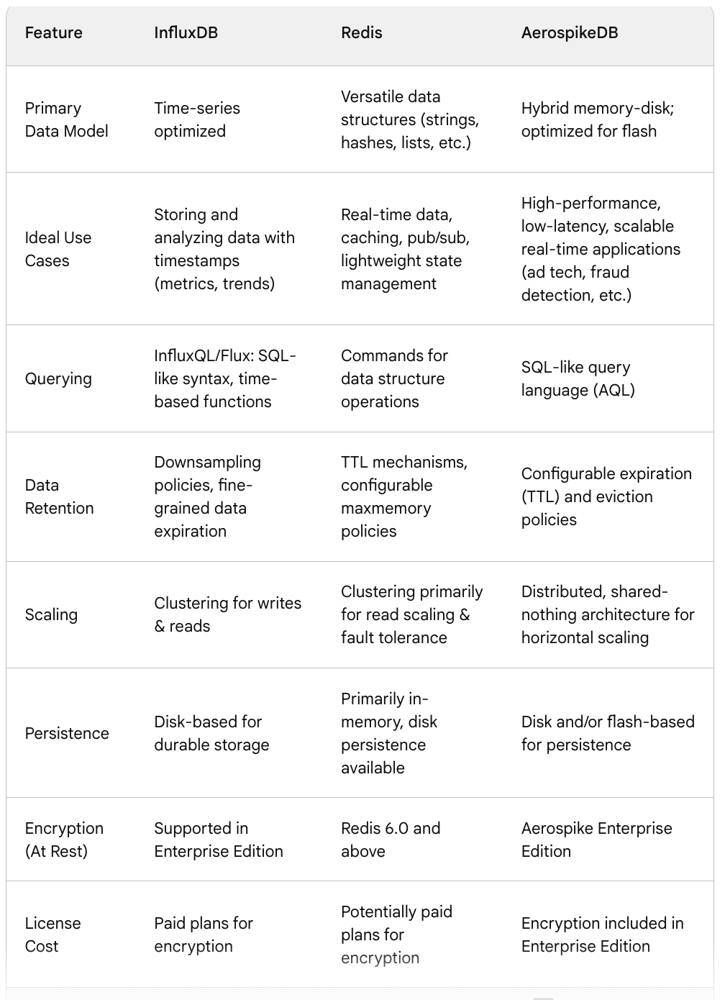

# 1A / Data Volumes

WIP determining data volume and storage. Will use to figure out hardware/storage constraints/requirements.

Current estimation: 

## Status: 
WIP

## Context: 
In order meet latency requirements, we need to use the fastest possible database as backing for our Dashboard application and associated Alert application.
Our dev team has previously succesfully built applications on MySQL.  They do not have experience with event-based or time-series databases. Applications requirements include high availability and strong data encryption.

## Decision: 

We compared features of several databases.  See summary table below.

- Use event-based in-memory database for core applications to meet latency requirements
- Test open-source (Redis) and commercial (Aerospike) event databases. Possibly test commerical (InfluxDB) time-series database.
- Use relational database (MySQL) for intermediate storage and transformation before pushing to downstream databases (FIHR) and data services 

## Consequences: 
- Add training time for using event databases for dev team to budget.  If Redis, there is a large amount of open source training material and examples.  Training for Aerospike or InfluxDB would be more costly.  
- If open source events, we may spend excessive time setting up other required capabilities, i.e. failover clustering for high availability, snapshots, data encryption-at-rest, etc...
- If commercial events or time-series, we must consider licence cost as a tradeoff to be able to implement required features (listed above) more quickly, easily and reliably
