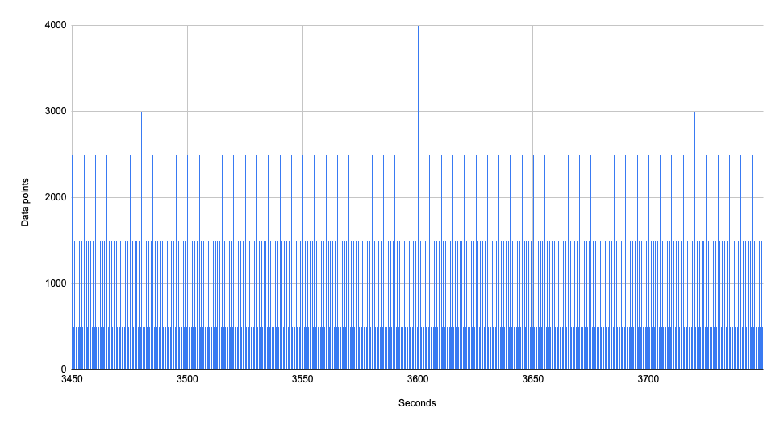

# 1A / Data Volumes

WIP determining data volume and storage. Will use to figure out hardware/storage constraints/requirements.

Aggregate traffic estimation: 

Based on this, the system generates ~24 GB/mo in raw sensor data.

While this is a lot of data, it is not Really Big Data. For example, this [statsd discussion](https://github.com/statsd/statsd/issues/249) from 2013 references stats instances sending >15k metrics per second to Graphite.

## Status: 
Reviewed, updated and intital technologies selected - see `Decision` section of this document for detail.

## Context: 
We have two use case categories: **real-time** and **regular**.

All data must be strongly encrypted & secure.

### Real-time use cases:

**Real-time** data must be fully processed in less than a second. For example, a heart-beat reading must appear on the nursing station monitor dashboard within less than a second. These use-cases are real-time:

- record >2k vital signs per second for 500 patients
- display patient vitals on up to 25 Nursing Dashboard applications (20 patients per station, 500 patients max)
- identify & alert upon problematic vitals for 500 patients & 8+ vitals streams

Assuming a five-nines, 99.999% uptime, which allows for 0.86s daily outage[^1] (~5min/yr), a 1s response time leaves 0.14s in the worst case. However a four-nines, 99.99% uptime allows for 8.6s daily outage (~52min/yr).

### Regular use cases:

These use cases are less sensitive, ranging between seconds and a few minutes.

- report & data analysis (seconds for UX reports, >30s for background reports)
- uploading deidentified data to MyMedicalData (need to upload 1x/day?)
- uploading data to MonitorThem (~30s?)
  - This assumes data uploads occur while on the phone with another person. If no synchronous behavior is expected, it could take several minutes.

Generally speaking, we expect these to be relatively low-impact jobs, but they should never disrupt patient care.

## Traffic analysis:

### Queue processing rates

The aggregate traffic analysis pretends that traffic is distributed uniform at 2.2k/s for 500 patients, which isn't accurate. In fact, the devices generate data in bursts. Here are the readings for just over an hour:

Note the bursts every hour, 5min, and 10min: these follow from the specified frequencies. Here are the readings for the 5 minutes around the hour mark:

If we were to process 2.2k messages per second–the average frequency–our queue depth would look like so:

The largest burst is ~4k messages, at the hour mark, when all readings happen simultaneously. The queue fills to just shy of 1.2k messages, but catches up quickly. Over the next 0.5s, 1.1k messages are processed leaving 0.1k. Then 500 points are read, putting the queue at 0.6k. The held 0.1k are processed over ~0.1s,  These are processed over the next 0.5s, then at that minute mark 1500 points are added & on we go. The upshot is, even at the biggest burst, **the oldest message is ~0.6s old when processed at 2.2k/s**. This leaves ~0.4s to process putting that point on the appropriate real-time patient dashboard.

However, the system no longer keeps up when processing 1.1k messages per second:

For curiosity's sake the queue manages to catch up–barely–when processing 1,103 messages per second:

Processing 3k messages per second:

Processing 4k messages per second:

Clearly, the faster we process, the more time the queue spends empty, and the more resilient we are to downgraded processing rates.

In practice, the readings won't occur simultaneously for all sensors and all patients. That's actually good for us as it spreads them out over each half second. Our processing is not simultaneous either after all.

### Network traffic

MonitorMe generates data frequently. Following the above assumptions, sensor events generate *at least* this much traffic:

- 19.36 MiB (megabits) = 2.42 MB per second:
  - ~2.2k messages per second
  - 1 KB (1000 B) message size:
    - 32 bytes sensor type uuid
    - 32 bytes sensor uuid
    - 32 bytes datetime (`yyyy-mm-dd-hh.mm.ss.nnnnnnnnnnnn`, could reduce with binary)
    - 4 bytes sensor reading
    - 900 bytes for "other stuff"
  - +10% for message & protocol overhead
  - 2200 * 1 KB * 110% = 2.42 MB per second = 19.36 MiB (megabits) per second
- ~1.9% of a gibabit link

## Decision: 

We compared features of several NoSQL (in memory) databases and also queing libraries.  See summary table of potential NoSQL databases below.
**We decided to use RabbitMQ for HOT storage (rather than an in-memory database) along with MySQL for long-term storage.  See services ADRs for details.**

- Use event-based in-memory database for core applications to meet latency requirements
- Test open-source (Redis) and commercial (Aerospike) event databases. Possibly test commerical (InfluxDB) time-series database.
- Use relational database (MySQL) for intermediate storage and transformation before pushing to downstream databases (FIHR) and data services 

## Consequences: 
- Add training time for using event databases for dev team to budget.  If Redis, there is a large amount of open source training material and examples.  Training for Aerospike or InfluxDB would be more costly.  
- If open source events, we may spend excessive time setting up other required capabilities, i.e. failover clustering for high availability, snapshots, data encryption-at-rest, etc...
- If commercial events or time-series, we must consider licence cost as a tradeoff to be able to implement required features (listed above) more quickly, easily and reliably
# Notes
[^1]: outage calculations by [uptime.is](https://uptime.is/)
