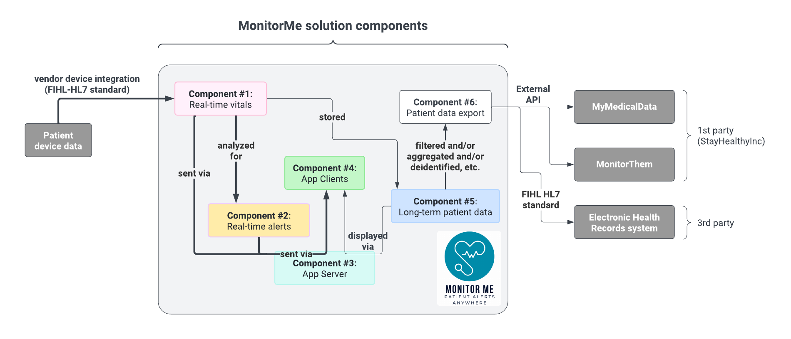
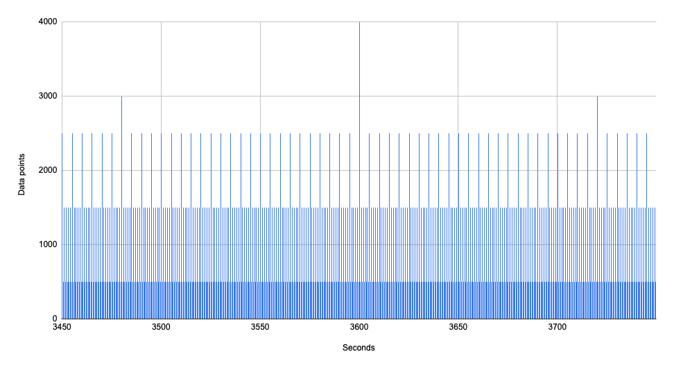
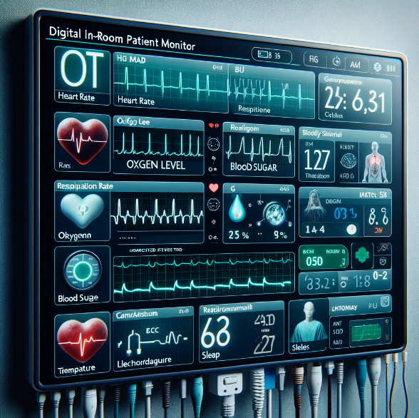
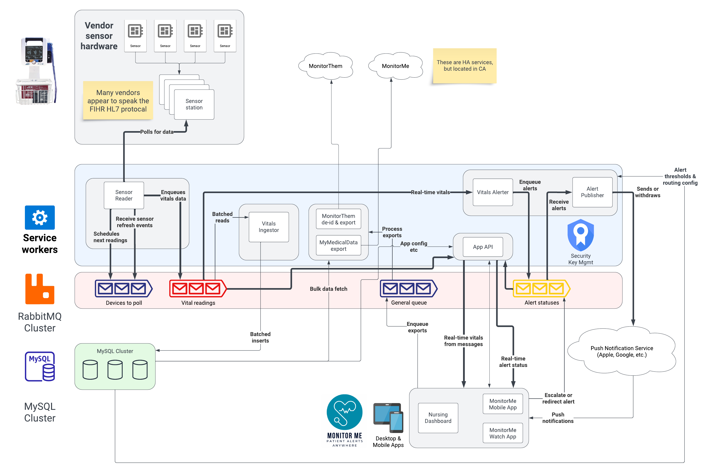

# 2A / Service Design

WIP determining service design. Will use to figure out service requirements from components

The MonitorMe service design implements these components:

This & related ADRs describe those components in more detail in order to design service implementation.

## Status: 
WIP

## Context: 
MonitorMe has 3 categories of components:

- patient data
- service workers & business logic
- application server & clients (nursing dashboard, mobile, etc.)

<insert diagram of 3 categories & relation>

Let's consider each.

### Patient data

The core patient data use cases can be grouped in two categories:

- real-time patient data collection, visualization, & alerting
- delay-tolerant patient data reporting, charting, & export

In both cases, security & privacy are key as this is sensitive personal health data. Note: we don't need to feed the **hipaa**potamus specifically for this kata.

The real-time data must be delivered & processed within a second, implying that the average delivery is well below 1s (or that response times are remarkably consistent). At maximum patient load with the current vitals configuration, MonitorMe produces 2.2K sensor readings per second on average. More precisely, it produces a lower but constant rate with occasional bursts. Here are the five minutes centered around the hour mark. The heart sensor is read the most often, once every 500ms for all 500 patients.

See also [ADR-1A: data volumes](ADR-1A-data-volumes.md).

Whereas alerts presumably happen less frequently, they must also be identified, processed, & sent in real-time. Based on interviewing a nurse, a hospital could have hundreds of alerts a day, many of which are false positives such as accidentally disconnected sensors.

The delay-tolerant data usage is a fairly usual matter of fetching data for a certain time range, for a certain number of patients, displaying it in apps or the browser, and exporting it to external applications. While maximum patient load generates ~200M data points a day, it's only ~400k per patient. Assuming a 4-byte binary representation per point:

| Period | Total storage | Per-Patient |
| ---: | :--: | :--: |
| Per day | 800 MB | 1.6 MB |
| Per month | 24 GB | 48 MB |
| Per year | 292 GB | 584 MB |

While nothing to sneeze at, 300 GB fits 13 times into a commodity 4TB SSD. Well, fewer times, given DB indexes, overhead, etc. If we need to query more than 5 years into the past, we could provide a value-add data warehouse. It may also be acceptable to simply discard old data from MonitorMe if it's been integrated into the patient's electronic health record's database.

### Service workers & business logic

MonitorMe is a distributed system, integrating with hundreds or even thousands of medical devices, not to mention a broader ecosytem of electronic health records both by StayHealthy Inc. and third-party vendors.

While some business logic is fairly static (example: the HL7 health data standard), other aspects of our solution are dynamic. Despite standardization, medical devices & monitoring stations all have their quirks. The sensor devices change as technology evolves. Our understanding of the customer will evolve. The customer's business processes will also evolve.

As such, it's important 

This ADR covers the services. (WIP high level overview)

## Decision: 

The dev team has successfully designed multiple previous applications using microservices approaches.   
- Queues - throttle 
- Fetch - get data
- Disply - create viz
- Transform data - multiple scenarios - deidentify, xform for FIHR/HL7
- Push to external - push to two external services
  
## Consequences: 
- The cost of designing, coding, testing, deploying and maintaining multiple services must be included in the budget.
- The cost of supporting servers (hardware and storage) and load balancer servers (for high availabilty) must be included in the budget
- The cost of performing regular disaster recovery drills to verify that the failover solution works as expected must be included in the budget.
