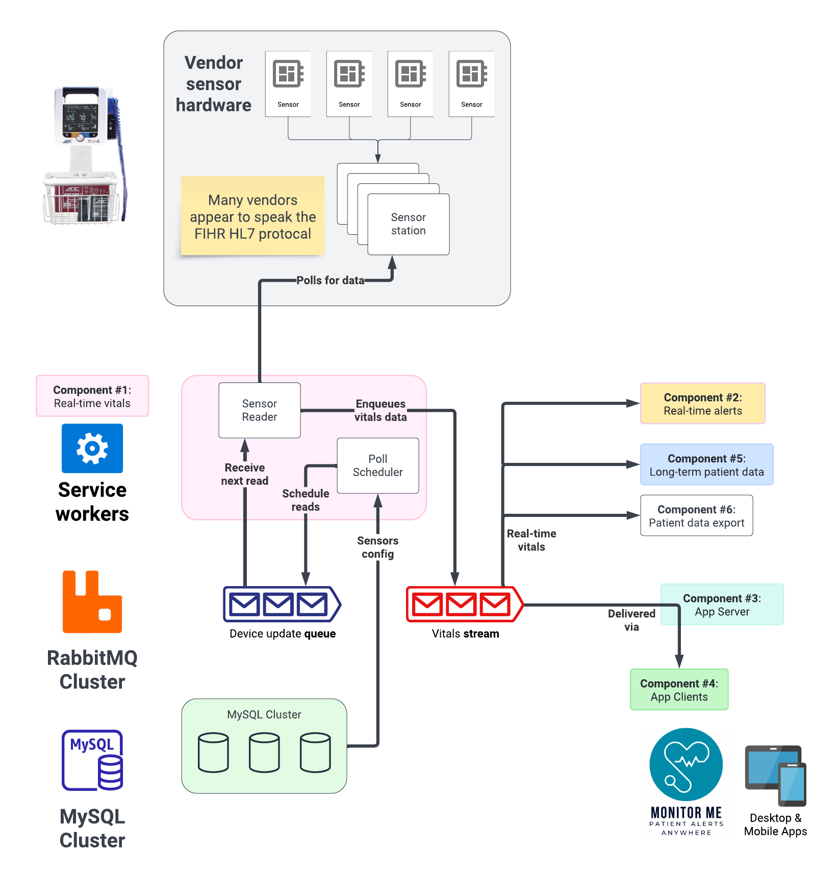

# 2C-1 / Service: Real-time vitals

See also: [ADR-2A Service Design](ADR-2A-services-design.md)

The core task of the real-time vitals component is to poll sensor devices & stations, and report the results to a stream of vitals data.

## Reading sensor data

Per [ADR-1A Data Volume](ADR-1A-data-volumes.md) we expect to read ~2.2K sensors per second on average.

### Poll scheduler

The poll scheduler worker is a clock loop:

- Check device/sensor poll schedule
- Enqueue ready sensors to the **device update queue**
- Wait 500ms (adjust for time spent in loop)

It obtains devices & their schedules from the database. To refresh configuration, the operator simply restarts the worker. As long as one worker is online, polls will be scheduled.

#### Concerns

- **Falling behind**. If the scheduler took more than 500ms per loop, it could delay the most frequent reads. But this is unlikely. The largest burst is ~4k reads (see data volumes). Whereas [RabbitMQ benchmarking](https://www.rabbitmq.com/blog/2023/05/17/rabbitmq-3.12-performance-improvements#quorum-queues) shows ~20k msgs/s write performance to a similarly spec'd 3-node cluster.

### Sensor reader

The sensor reader worker performs the following loop:

- Receive batch of devices & sensors to update from the **device update queue**
- Collapse by device & dedupe sensors
- For each device, launch async call:
  - poll the device for requested sensors
  - write sensor's datum to the **vitals stream**.
  - consume message from **device update queue**

#### Concerns

- **Batch size tuning**. We'll need to benchmark which [consumer prefetch](https://www.rabbitmq.com/docs/consumer-prefetch), aka batch size, gives us the best performance. We could start with 10.
- **Read time**. How quickly do the patient monitoring devices return data? Is it realistic to expect a response every 500ms? There's no point reading it as fast as we can.
