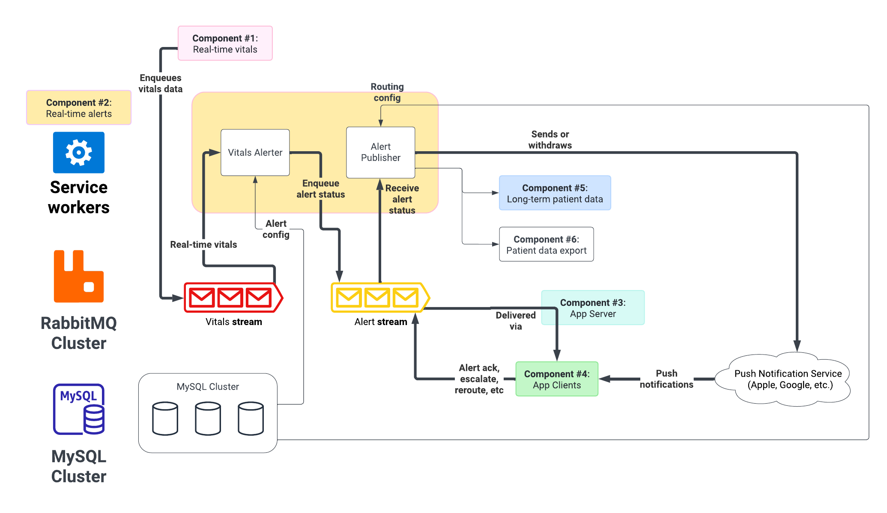

# 2C-2 / Service: Real-time alerting

🚧

See also: [ADR-2A Service Design](ADR-2A-services-design.md)

The core task of the real-time alerts component is to read from the vitals stream, create alerts according to configuration, and deliver alerts to active or via push notifications to mobile devices. Staff interacts with the alert stream to acknowledge, close, escalate, & reroute alerts.

## Note on streams and queues

RabbitMQ [queues](https://www.rabbitmq.com/docs/quorum-queues) follow a normal produce-consume model: when a message is acknowleged as consumed, it goes away. This prevents multiple clients from receiving the same update.

In our case, many workers are interested in the vitals & alert data. Therefore we [Streams](https://www.rabbitmq.com/docs/streams) which may be read repeatedly by multiple clients. This makes them suitable to many clients subscribing to the feed.

## Vitals alerter

The vitals alerter is responsible for putting patients into alert states. Today, our requirements are simple: if a value is above or below a threshold, the patient is in alert state.

An alerter worker gets alert config (thresholds) from the database during initialization. To refresh thresholds, simply restart the worker.

Each service node runs an alerter worker.

## Alert publisher

asd
