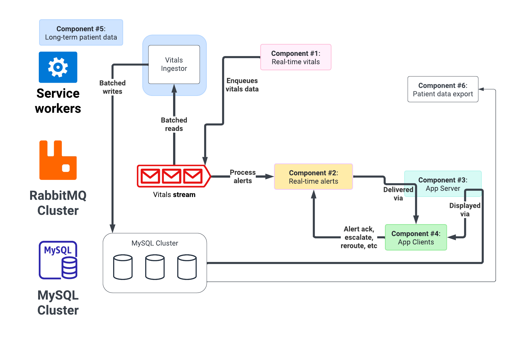

# 2C-5 / Service: long-term data

See also: [ADR-2A Service Design](ADR-2A-services-design.md)

The core task of the long-term data service is to ingest from the vitals stream, and insert into the database. It is the "ETL" from real-time into SQL.

This service is relatively simple. With a high prefetch count (aka large stream read), and bulk SQL inserts, we can insert many rows very quickly.

As with other services, we can use single-stream consumers to support availability if a stream goes down, while simplifying concurrency.