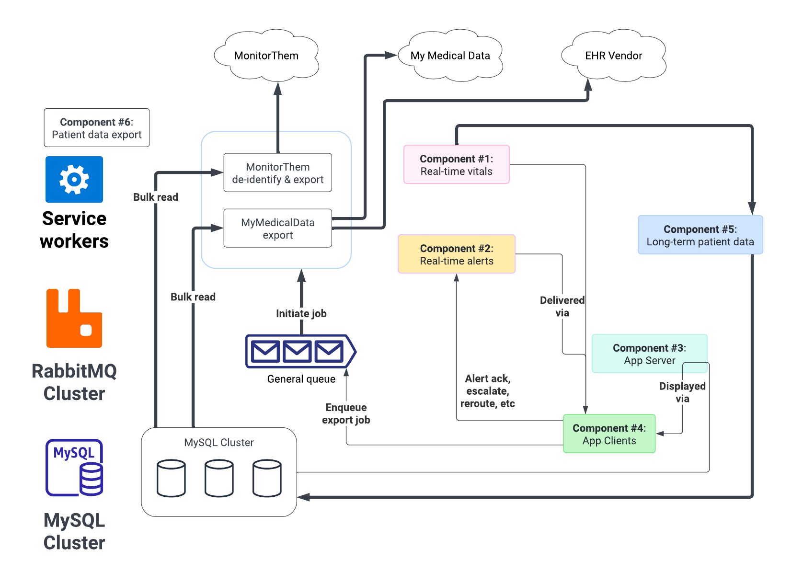

# 2C-6 / Service: Data export

See also: [ADR-2A Service Design](ADR-2A-services-design.md)

The core task of the data export service is to read data from long-term storage and export it to external services.

This service is relatively simple. Bulk-fetch the data for the time period, process as necessary, then send to downstream service.

The main complexity is understanding EHR integration. Hopefully, the HR7 protocol "solves" this for us.

Open questions:

- how often do we need to export to EHR? On staff command, or periodically?