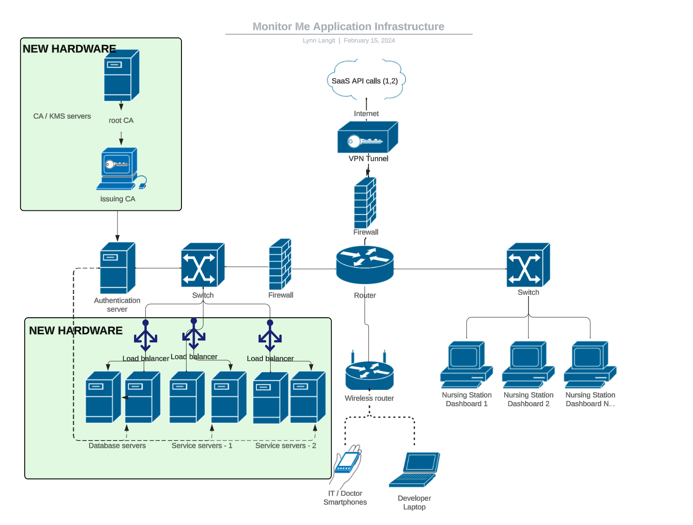
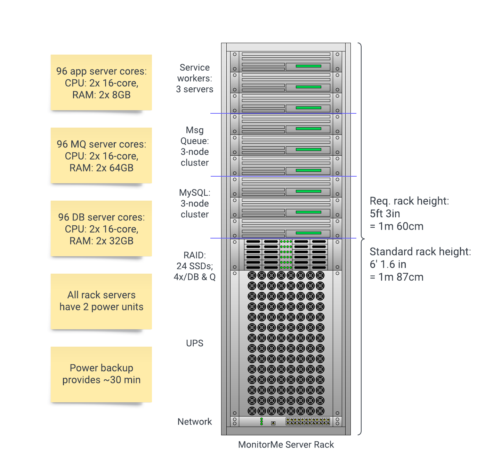

# 3B / Hardware

Determining production environment. Will use to figure out minimum new hardware constraints/requirements

Current estimation: Purchase new servers, appropriately sized, as shown in green areas on diagram below.   
*Notes: This is a conceptual hardware diagram, see diagram in `Server Rack` section for more detail. Also, due to updated requirements, we now plan to purchase wearable devices for nurses in addition to the hardware shown here*

## Status: 
Reviewed and updated given our decision to use RabbitMQ (rather than an in-memory NoSQL DB), MySQL and to build a number of custom Java services.

## Context: 
In order to deploy `MonitorMe` on premise meeting the performance, reliability and security requirements, we select, purchase and deploy a number of new servers to the production environment.

## Decision: 
Purchase and configure appropriately-sized hardware to support the solutions components listed below.  See `Server Rack Specs & Cost` section for detail.
- Database - deploy two, appropriately-sized servers to build a failover RabbitMQ cluster.  Plan to Load test and purchase appropirately sized fast disks to meet latency requirements.
- Services - deploy two, appropriately-sized compute clusters. Use load balancers for HA.
- Encryption - deploy lightweight KMS / CA solutions. Deploy root CA and issuing CA.  Consider adding redundancy for HA.

*NOTES: Due to newly surfaced requirement to include a wearble for nurses, we'll start by buying and coding for programable watches, such as [this one](https://www.amazon.com/SmartFly-info-ESP32-Based-Programmable-MicroPython/dp/B08LKGS2CF?th=1).  Eventually, we may chose to prototype a custom hardward solution, possibly by working with prototyping partners such as [this one](https://www.lkkerscm.com/) in Shenzhen, China.*
  
## Consequences: 
- Time to select, order, receive, setup and configure new hardware may impact project schedule.
- Adequate Load testing prior to selecting hardware is critical to selecting appropriately-sized hardware.

## Considerations / Questions:
- More new servers may be required to meet HA requirements.  For example, interal CA/KMS does not have redundancy at this time.
- Ideal form factor is easy to transport, set up, and maintain. Commodity hardware is preferred whenever possible as it's easier to service & replace.
- Power redundancy is an important consideration, but UPS units are modular: easy to include, or provide separately.

## Server Rack Specs & Cost

The entire MonitorMe backend, including power backup, can fit in a single server rack with some room to grow. Without power backup, space & cost requirements go down considerably.

Here's a breakdown & cost of the rack components. Note: these costs are from quickly searching public consumer prices. A bulk vendor agreement is key to reducing costs.

Total rack cost:

* ~$82k & 36U for full rack: servers, networking, & power backup
  * *Price does not include RAID/SSD drives cost, TBs unknown*
  * Without UPS: ~$52k & 22U

Rack servers: ~$52,200

* App/service servers: ~$13,500
  * 3 2U rack servers @ $4700 each [[Dell](https://www.dell.com/en-us/shop/servers-storage-and-networking/poweredge-r7525-rack-server/spd/poweredge-r7525/pe_r7525_tm_vi_vp_sb?configurationid=657ab20d-ff20-4b19-9d35-126d9b4910df)]
  * Specs: 2 16-core CPUs, 2x 8GB RAM, dual 800W power
  * NOTE: might need more than 16 cores, tbd
* Message queue servers: ~$21,600
  * 3 2U rack servers @ ~$7200 each [[Dell](https://www.dell.com/en-us/shop/servers-storage-and-networking/poweredge-r7525-rack-server/spd/poweredge-r7525/pe_r7525_tm_vi_vp_sb?configurationid=d8c62001-a94b-4d2a-8639-478808579a2e)]
  * Specs: 2 16-core CPUs, 2x 64GB RAM, dual 800W power
* Database servers: ~$17,100
  * 3 2U rack servers @ ~$5700 each [[Dell](https://www.dell.com/en-us/shop/servers-storage-and-networking/poweredge-r7525-rack-server/spd/poweredge-r7525/pe_r7525_tm_vi_vp_sb?configurationid=d02dad52-4f20-4917-af2f-66b38f780400)]
  * Specs: 2 16-core CPUs, 2x 32GB RAM, dual 800W power
* Power usage: 14,400W at full draw
  * 9 servers * 1,600W per server
  * I don't know if we need the full dual power for the dual 800W power supplies, or if the 2nd only runs if the 1st is dead

RAID: $?

* 24 SSDs, **??TBs**
  * 4x for each MySQL node
  * 4x for each MQ node
* Power: ~480W at full draw
  * Estimating ~20W/SSD; high end from [SuperSSD.com](https://www.superssd.com/kb/ssd-power-consumption/)

Networking: $135

* 24-port gigabit switch [[Amazon](https://www.amazon.com/Tripp-Lite-Ethernet-Rackmount-NG24/dp/B01MSYIOQY?th=1)]
* Power: ~20W

Uninterruptible power supply: $30,000 [[APC](https://www.apc.com/us/en/tools/ups_selector/server/load/params?minPower=16000&powerUnit=w&operatingVoltage=120&runtime=30&powerExpansion=0&topology=&rackMountable=true&maxPower=20000)]

* Usage: 14,900W servers + 480W RAID + 20W network
* UPS provides 16,000W for 38min

Rack: ~$300

* 42U rack [[Amazon](https://www.amazon.com/StarTech-Network-Rolling-Computer-Equipment/dp/B00HVKOPBW)]
  * 42U is standardized height
  * Minimum height: 36U, 1.60m
  * Leaves room to add 6U
    * Servers at 1-2U each
    * RAID at 8 SSDs per 1U
* Note on expansion:
  * Current UPS leaves ~1600W buffer, which is approx. 1 server's max draw
  * More rack units may require adjusting UPS specs

For additional redundancy, customers can purchase an additional rack for a second server room and run the clusters across the racks. This allows the hospital to continue operating in case an entire room loses connectivity. A quality network link is required in this case, along with thoughtful node distribution. For example, clusters need odd numbers of nodes, not 2*3 = 6. We should consider providing expert deployment & support services for this advanced use case.
