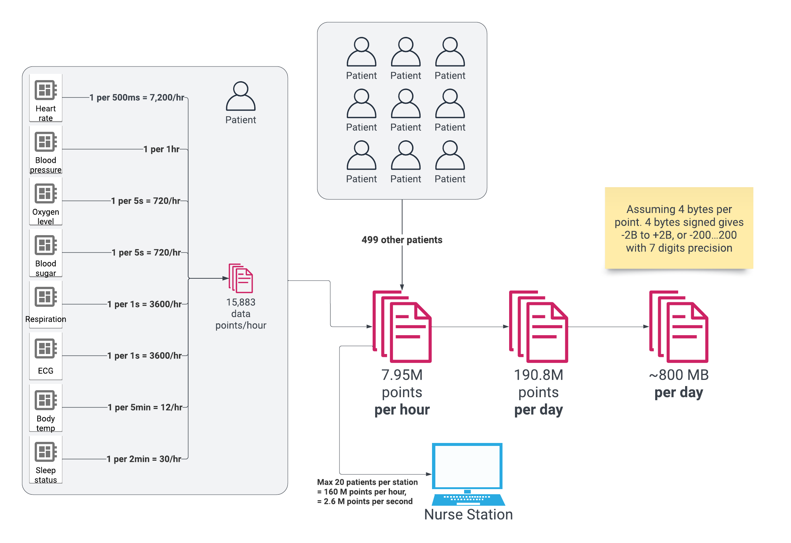

# XYZ / Data volumes

WIP determining data volume. Will use to figure out hardware/storage constraints/requirements

Current estimation: 

## Status: 
WIP

## Context: 
In order to scale delivery both at home and on the smart fridges, we need a delivery optimization and scheduling system.

## Decision: 
Otter will be used as a starting point for delivery optimization, on the basis of very quick integration, since it already supports Toast as part of its integrations. It also supports Uber Eats, Caviar and Postmates for ordering. Alternatives like OptimoRoute or Circuit can be employed when scale proves to be a problem.

## Consequences: 
The direct integration means that we have limited access and flexibility.
