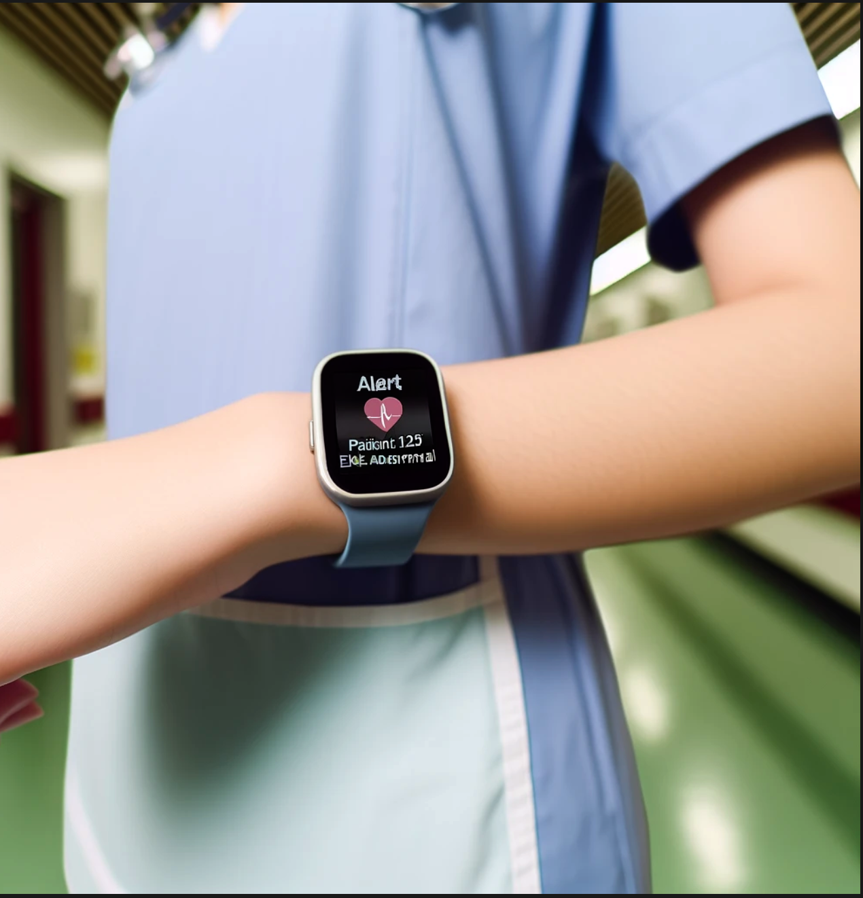

# Information for O'Reilly Kata

Architectural Kata activity `MonitorMe` application challenge - Feb/Mar 2024. 

### CURRENT STATE / CHALLENGES: 
Hospital nurses and doctors need timely patient status in order to provide the highest quality patient care. Several **gaps exist** in the current US hospital market.  The first step in designing and building a new solution is to address these gaps by considering [current US hospital statistics](https://github.com/lynnlangit/architects-who-code/blob/main/Kata-2024/domain-info/hospitals.md). Understanding challenges faced by medical professionals and those who support them in providing top quality hospital patient care the best starting point for this design process.
1. Nurses need to be immediately alerted to key pateient metrics from an aggregate patient monitoring system at the nurse's station **while they are working in any location in the hospital**.
   - Currently they must be 'in-room' to gather patient monitoring information from [individual patient dashboards](https://github.com/lynnlangit/architects-who-code/blob/main/Kata-2024/domain-info/devices.md)
   - Aggregate patient dashboards at nurse's stations have latencies, inaccuracies or are non-existant
   - Wearable alert devices do not yet exist for nurses
   - 👨‍⚕️ [nurse user-story](https://github.com/lynnlangit/architects-who-code/blob/main/Kata-2024/domain-info/user-stories.md#nurses) and [nurse-interview](https://www.youtube.com/watch?v=3mDUZpnXJJ4)
2. Doctors need to get **patient monitor status for abnormal states rapidly** via timely, relevant alerts.
   - Abnormal rating alerts, when available, have excess latency, downtime & aren't always focused on key patient metrics, resulting in alert fatigue.
   - 👩🏻‍⚕️ [doctor user-story](https://github.com/lynnlangit/architects-who-code/blob/main/Kata-2024/domain-info/user-stories.md#doctors)
3. IT needs to get **monitor down status notifications rapidly** via timely, relevant alerts.
   - Downtime system alerts have excess latency, are unreliable & aren't always focused on key system metrics, resulting in alert fatigue.
   - 🧑‍💻 [IT user-story](https://github.com/lynnlangit/architects-who-code/blob/main/Kata-2024/domain-info/user-stories.md#it--system-maintainers)

----

### GOAL: 

Design new `MonitorMe` applications to work with **existing in-room patient devices / individual patient monitors** deployed in US Hospitals.  Additional [Solution Requirements](https://github.com/lynnlangit/architects-who-code/blob/main/Kata-2024/ADRs/ADR-0-required-bilities.md#solution-requirements) and associated ranked solution capabilties.
1. Create ALERT app for nurses from patient information DASHBOARD application (per 20 patients max) per nurse with minimal latency which displays current hospital patient information input from 8 patients devices for max 500 patients per installation
2. Create ALERT app for doctors (abnormal patient device readings), create alerts for IT (dashboard down)
3. Create INTEGRATION app to prepare (transform)/push patient data to existing cloud-based SaaS Products (`MonitorThem` and `MyMedicalData`)

    
---

## Solution Concept 1A: Nurse's Personal Alert Device

SOLUTION 1A: Wearable Alert device (concept shown to the left) for nurses. Device would show subset of most critical patients and be worn for entire shift. 
- Shows info from key patient alerts on monitoring device for up to 5 patients
- Subset of aggregate patient info from monitor dashboard
- Device envisioned in a watch-like size as a wearable on nurse's wrist
- Alternatively, device could also be worn as a necklace

---

## Solution Concept 1B: Central Patient Info Dashboard

SOLUTION 1B: Visual Dashboard (concept shown below) for monitoring personnel, commonly called 'telemetry technician' 
**IMPORTANT: Monitoring personnel may or may not be nurses. In many hospitals nurses do NOT sit at aggregate monitoring stations.** 
- Shows monitoring info per patient, info changes to next patient every 5 seconds
- Shows info from 8 patient monitoring devices for up to 20 patients per aggregate dashboard
  
---

## Solution Concept 2A & B: Mobile Alerts - Patient Info for Doctors and System Status for IT

SOLUTION TWO: Alert Systems for Doctors and IT Professionals. Doctors to get patient monitor status for defined key alerts. IT to get system down alerts.  
- Alerts on defined/customizable patient device thresholds to doctors mobile phone (concept shown below) as Alert Type A
- Alerts on dashboard application downtime to IT pro's mobile phone as Alert Type B (concept NOT shown)

---

## Solution Concept 3: Integration with SaaS Applications
SOLUTION THREE: Integration Applications with existing SaaS cloud services hosted in public cloud region in us-west1 (California). Two existing API endpoints will be populated with patient data on a scheduled basis. Middleware will prepare data before sending to endpoints.
- Integrator w/ **individual** Patient Record, then PUSH to external API 1 `MyMedicalData`
- Integrator w/**Aggregate** Patient Event Data, then PUSH to external API 2 `MonitorThem`

----

### Solution Components

Components shown in diagram below. DARK GREY are currently existing components, the SIX components shown inside the light grey box will be built for the `MonitorMe` application.  
- Additional detailed solution diagrams for various pespectives are included in ADRs.
- List of ADRs is linked below and includes solution details.  

### ADRs - List of related ADRs and links to documents
- [ADR-0:GENERAL - Restate Requirements and match Solutions characteristics (or `bilities)](https://github.com/lynnlangit/architects-who-code/blob/main/Kata-2024/ADRs/ADR-0-required-bilities.md)
- [ADR-1A:DATA - Forecast data volume and consider database types for data volume and types](https://github.com/lynnlangit/architects-who-code/blob/main/Kata-2024/ADRs/ADR-1A-data-volumes.md)
- [ADR-1B:DATA - Plan uptime SLO and consider database types and features for data availability](https://github.com/lynnlangit/architects-who-code/blob/main/Kata-2024/ADRs/ADR-1B-data-availability.md)
- [ADR-1C:DATA - Review security baseline and consider database types and features for data security](https://github.com/lynnlangit/architects-who-code/blob/main/Kata-2024/ADRs/ADR-1C-data-security.md)
- [ADR-2A:SERVICES - Review component baseline and consider service design pattern options](https://github.com/lynnlangit/architects-who-code/blob/main/Kata-2024/ADRs/ADR-2A-services-design.md)
- [ADR-2B:SERVICES - Review component availability and consider service design pattern options](https://github.com/lynnlangit/architects-who-code/blob/main/Kata-2024/ADRs/ADR-2B-services-availability.md)
- ADR-2C SERVICES:
  - [ADR-2C-1: Consider Component #1: Real-time vitals](ADRs/ADR-2C-1-realtime-vitals.md)
  - [ADR-2C-2: Consider Component #2: Real-time alerts](ADRs/ADR-2C-2-realtime-alerts.md)
  - [ADR-2C-3: Consider Component #3: App server](ADRs/ADR-2C-3-app-server.md)
  - [ADR-2C-4: Consider Component #4: App clients](ADRs/ADR-2C-4-app-clients.md)
  - [ADR-2C-5: Consider Component #5: Long-term patient data](ADRs/ADR-2C-5-longterm-data.md)
  - [ADR-2C-6: Consider Component #6: Patient data export](ADRs/ADR-2C-6-data-export.md)

- ADR-2D DATA:
  - [ADR-2D-1: Consider real-time messaging](ADRs/ADR-2D-1-data-messaging-queues.md)
  - [ADR-2D-2: Consider SQL database](ADRs/ADR-2D-2-data-sql.md)

- [ADR-3A:ENV - Review dev environment and team capabilties and consider language, tools and patterns](https://github.com/lynnlangit/architects-who-code/blob/main/Kata-2024/ADRs/ADR-3A-dev-env.md)
- [ADR-3B:ENV - Review physical environment and plan for required new hardware](https://github.com/lynnlangit/architects-who-code/blob/main/Kata-2024/ADRs/ADR-3B-hardware.md)

----

### Team

- David Haley - https://www.linkedin.com/in/davidchaley/
- Lynn Langit - https://www.linkedin.com/in/lynnlangit/
- AI Partners - Gemini Pro Advanced + ChatGPT 4.0 + plugins (DALLE and others)

