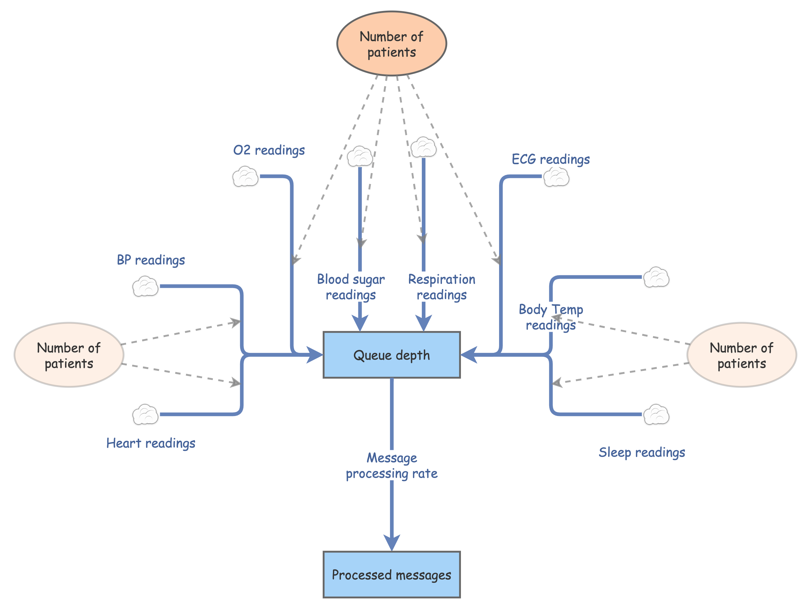

# Queue Depth Helpers

Support files to generate queue depth analysis:
- python script to show data points per 500ms (+ csv result)
  - Google sheet w/ chart: [link](https://docs.google.com/spreadsheets/d/1oJgO_2NXBT-2LNPxGEDmB2Knw3b4h-JQ3EAjA_czPpg/edit#gid=0)
- InsightMaker simulation file
  - Online simulation: [link](https://insightmaker.com/insight/6Oeuo1QsOL7MwRaCRJETuP)

InsightMaker is a system dynamics simulator. It makes it easy to specify flow rates in & out. In our case, each sensor generates readings every few seconds (or minutes, hours, etc.), multiplied by the number of patients. This fills up the queue depth, which is emptied at the message processing rate.

Using this model, we modeled queue depth by various processing rates. Results in: [ADR-1A Data Volumes](../../ADRs/ADR-1A-data-volumes.md)

Example: processing 500 patients of data, at 2000 points per second:

